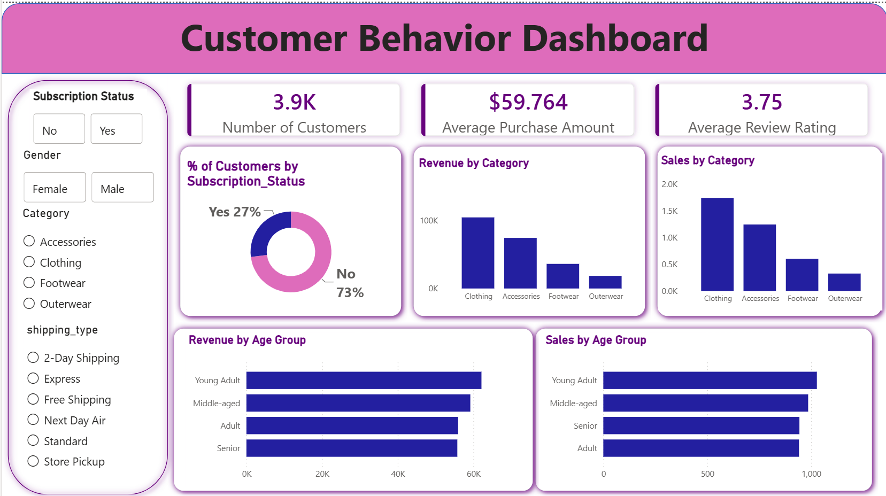

# Customer Behavior Analysis
An end-to-end Data Analytics portfolio project analyzing customershopping behavior, purchasing patterns, revenue performance, andcustomer segments using Python, PostgreSQL, SQL, and Power BI.
The project takes raw customer shopping data through data cleaning andexploratory analysis, transforms the data for business analysis,performs SQL-based analysis in PostgreSQL, and presents the results through an interactive Power BI dashboard.

# Project Overview
Understanding customer purchasing behavior helps businesses identifyhigh-value customers, understand product preferences, evaluatepromotional strategies, and make better decisions around products,marketing, and customer engagement.

## Dashboard Preview



---

## 📊 Project Highlights

| Metric | Result |
|---|---:|
| 🛒 Total Orders | **3,900** |
| 💰 Total Revenue | **$233,081** |
| 💵 Average Order Value | **$59.76** |
| 📦 Product Categories | **4** |
| 📍 Locations Analyzed | **50** |

---

## 🎯 Business Objectives

This project aims to answer key business questions:

- Which product categories generate the most revenue?
- Which products are the top revenue contributors?
- Which customer age groups generate the most revenue?
- Who are the high-value customers?
- How does purchasing behavior vary by season?
- Which payment and shipping methods are most popular?
- How does subscription status relate to purchasing behavior?
- Which locations generate the highest revenue?
- How do discounts and promo codes relate to purchases?
- What actionable strategies can improve customer retention and revenue?

---

# 🛠️ Tools & Technologies

### Python
- Pandas
- NumPy
- Matplotlib
- Seaborn
- Jupyter Notebook

### Database
- PostgreSQL
- SQLAlchemy
- Psycopg2

### SQL
- Aggregations
- `GROUP BY`
- `CASE WHEN`
- CTEs
- Window Functions
- `RANK()`
- `PARTITION BY`

### Visualization
- Microsoft Power BI

### Version Control
- Git
- GitHub

---

# 🔄 Project Workflow

```text
Raw Dataset
     │
     ▼
Python / Pandas
     │
     ├── Data Cleaning
     ├── Data Validation
     ├── Feature Engineering
     └── Exploratory Data Analysis
     │
     ▼
Cleaned Dataset
     │
     ▼
PostgreSQL
     │
     └── SQL Business Analysis
     │
     ▼
Power BI
     │
     ├── KPI Dashboard
     ├── Customer Analysis
     ├── Product Analysis
     ├── Category Analysis
     └── Geographic & Seasonal Analysis
     │
     ▼
Business Insights & Recommendations
